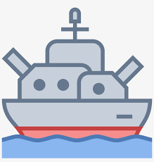

# Battleship Game with JavaScript

Welcome to the Battleship Game project! This is a simple implementation of the classic game Battleship using primarily JavaScript. In this project, we'll be creating a two-player version of Battleship that you can play right in your browser.

## Table of Contents

- [Introduction](#introduction)
- [Features](#features)
- [Getting Started](#getting-started)
  - [Prerequisites](#prerequisites)
  - [Installation](#installation)
- [How to Play](#how-to-play)
- [Gameplay](#gameplay)
- [Technologies Used](#technologies-used)
- [Contributing](#contributing)
- [License](#license)

## Introduction

Battleship is a classic guessing game for two players. Each player has a grid on which they place their ships, and they take turns guessing the coordinates of the opponent's ships. The objective is to sink all of the opponent's ships before they sink yours.

## Features

- **Two-Player Gameplay:** Play against a friend on the same computer.
- **Interactive Grids:** Visualize ship placements and guesses on the game boards.
- **Turn-Based:** Take turns guessing coordinates to locate and sink your opponent's fleet.
- **Winning Condition:** The player who sinks all opponent's ships first wins the game.

## Getting Started

### Prerequisites

Before you begin, make sure you have the following:

- A modern web browser (e.g., Chrome, Firefox, Safari)
- Basic understanding of HTML, CSS, and JavaScript

### Installation

1. Clone or download the repository: `git clone https://github.com/your-username/battleship-game.git`
2. Navigate to the project directory: `cd battleship-game`
3. Open the `index.html` file in your web browser.

## How to Play

1. The game is designed for two players, so gather a friend to play with.
2. Each player secretly places their ships on their grid. Ships can be placed vertically or horizontally.
3. Players take turns guessing the coordinates of the opponent's ships.
4. After each guess, the result will be displayed on the grid - "Hit" if the guess hit a ship, "Miss" if the guess was off target.
5. The game continues until all ships of one player are sunk.
6. The player who sinks all opponent's ships first wins the game.

## Gameplay

Here's a simplified gameplay sequence to give you an idea of how the game progresses:

1. Player A places their ships on their grid.
2. Player B places their ships on their grid.
3. Player A starts by guessing coordinates on Player B's grid.
4. Player B provides feedback - hit or miss.
5. Players continue taking turns until all ships of one player are sunk.

## Technologies Used

- HTML5 for structuring the page
- CSS3 for styling the game interface
- JavaScript for implementing the game logic

## Contributing

Contributions are welcome! If you'd like to contribute to the project, feel free to fork the repository and submit a pull request.

## License

This project is licensed under the [MIT License](LICENSE).

---

Enjoy the Battleship Game project! Have fun implementing, playing, and maybe even enhancing it. If you have any questions, feel free to contact us.

*Note: The above content is a template for a README.md file and should be customized according to your project's specifics.*
